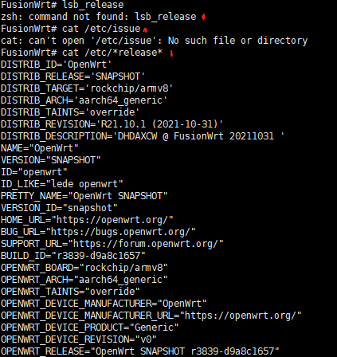

# 1.调查并记录实验环境的如下信息

使用**Debian9**，**Ubuntu20.04**，**OpenWrt**进行试验,其中Debian是自己的VPS，所以选择打马赛克。

- ### 1.1当前 Linux 发行版基本信息

- 使用`lsb_release`命令:

- 使用`cat /etc/*release*`查看etc目录中包含release字段的文件:

  

- 使用`cat /etc/issue`查看:

- 测试发现我使用的这款OpenWrt默认未安装lsblk,且不存在issue文件:

### 1.2当前 Linux 内核版本信息

使用`hostnamectl | grep -i kernel`命令查看内核信息:

- Ubuntu:
- Debian:
- OpenWrt:OpenWrt未安装`hostnamectl`,因此改用`uname -srm`:

# 2.Virtualbox 安装完 Ubuntu 之后新添加的网卡如何实现系统开机自动启用和自动获取 IP？

- 在Virtualbox中添加两块网卡:

  

- 配置在`netplan`下的yaml文件,将两块网卡的`DHCP`功能打开，即把dhcp参数设置为`true`:

# 3.如何使用 scp 在「虚拟机和宿主机之间」、「本机和远程 Linux 系统之间」传输文件？

- **虚拟机和宿主机之间**:
  - 在虚拟机中创建文件:
  - 在宿主机中使用`scp -r lsj@192.168.56.103:/home/lsj/test-dir ./`命令将文件传输到本地:
  - 确认传输成功:

- **本机和远程 Linux 系统之间**:
  - 在本地通过scp命令上传文件，因自己的vps没有设置通过口令登录的选项，故需添加参数`-i /你的私钥路径 `才能使用私钥登录:
  - 确认传输成功:

# 4.如何配置 SSH 免密登录？

- 在本地客户端使用ssh-keygen命令生成密钥:

- 将生成的.pub公钥文件写入服务器~/.ssh/authorized_keys中:
- 使用`$ chmod 644 ~/.ssh/authorized_keys将`authorized_keys文件的权限设为644，即只有文件所有者才能写。如果权限设置不对，SSH 服务器可能会拒绝读取该文件。

- 使用 `ssh-add`命令将刚才生成的私钥设置为默认私钥，或在**Xshell**、**PuTTY**等SSH客户端中导入私钥:

- 免密登录成功:
- 也可通过使用 `ssh-copy-id -i key_file user@host`自动上传公钥

# 5.实验问题

- 在配置免密登录的环节中发现自己安装的Ubuntu还没有登陆过root用户，固找不到.ssh目录，之后通过命令 `ssh localhost`解决。

# 6.参考资料

[《SSH 入门教程》发布了- 阮一峰的网络日志](https://wangdoc.com/ssh/index.html)

[OpenSSH](https://www.openssh.com/)

