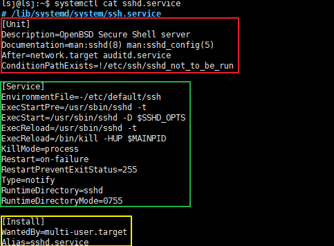
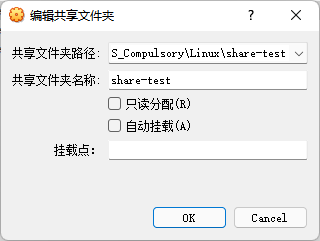
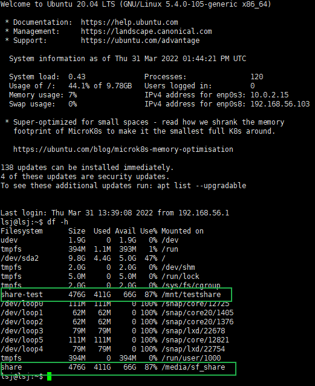

# 1 实验环境

- **Ubuntu 20.04.4 LTS (Focal Fossa)**

- **VirtualBox 6.1.28**

------

# 2 Systemd命令入门

### 2.1 systemctl

`systemctl`是 Systemd 的主命令，用于管理系统。

> ```bash
> # 重启系统
> $ sudo systemctl reboot
> 
> # 关闭系统，切断电源
> $ sudo systemctl poweroff
> 
> # CPU停止工作
> $ sudo systemctl halt
> 
> # 暂停系统
> $ sudo systemctl suspend
> 
> # 让系统进入冬眠状态
> $ sudo systemctl hibernate
> 
> # 让系统进入交互式休眠状态
> $ sudo systemctl hybrid-sleep
> 
> # 启动进入救援状态（单用户状态）
> $ sudo systemctl rescue
> ```

### 2.2 systemd-analyze

`systemd-analyze`命令用于查看启动耗时。

> ```bash
> # 查看启动耗时
> $ systemd-analyze                                                                                       
> 
> # 查看每个服务的启动耗时
> $ systemd-analyze blame
> 
> # 显示瀑布状的启动过程流
> $ systemd-analyze critical-chain
> 
> # 显示指定服务的启动流
> $ systemd-analyze critical-chain atd.service
> ```

### 2.3 hostnamectl

`hostnamectl`命令用于查看当前主机的信息。

> ```bash
> # 显示当前主机的信息
> $ hostnamectl
> 
> # 设置主机名。
> $ sudo hostnamectl set-hostname rhel7
> ```

### 2.4 localectl

`localectl`命令用于查看本地化设置。

> ```bash
> # 查看本地化设置
> $ localectl
> 
> # 设置本地化参数。
> $ sudo localectl set-locale LANG=en_GB.utf8
> $ sudo localectl set-keymap en_GB
> ```

### 2.5 timedatectl

`timedatectl`命令用于查看当前时区设置。

> ```bash
> # 查看当前时区设置
> $ timedatectl
> 
> # 显示所有可用的时区
> $ timedatectl list-timezones                                                                                   
> 
> # 设置当前时区
> $ sudo timedatectl set-timezone America/New_York
> $ sudo timedatectl set-time YYYY-MM-DD
> $ sudo timedatectl set-time HH:MM:SS
> ```

### 2.6 loginctl

`loginctl`命令用于查看当前登录的用户。

> ```bash
> # 列出当前session
> $ loginctl list-sessions
> 
> # 列出当前登录用户
> $ loginctl list-users
> 
> # 列出显示指定用户的信息
> $ loginctl show-user lsj
> ```

### 2.7 测试

| systemd-analyze                                              | hostnamectl/localectl/timedatectl/loginctl                   |
| ------------------------------------------------------------ | ------------------------------------------------------------ |
| [](https://asciinema.org/a/eI3aQSYrqsEBwvqH9wbQJe7Xu) | [](https://asciinema.org/a/kVTNJMLOiWs96sKqG6wfULyos) |

------

# 3 Systemd动手实战

### 3.1 启动服务

- 以**nginx**服务为例

| 演示                                                         | 命令                                                         |
| ------------------------------------------------------------ | ------------------------------------------------------------ |
| [](https://asciinema.org/a/BUvsdWbrHiiihCYbvdcRf95BZ) | `sudo systemctl enable nginx`<br/>`sudo systemctl start nginx`<br/>`sudo systemctl status nginx` |

### 3.2 停止服务

| 演示                                                         | 命令                                                         |
| ------------------------------------------------------------ | ------------------------------------------------------------ |
| [](https://asciinema.org/a/YM8bo5ep6vnqxbtCQUJynKmHS) | `sudo systemctl status nginx` <br/>  `sudo systemctl stop nginx`<br/>         `sudo systemctl kill nginx`   <br/>                                                              `sudo systemctl restart nginx` |

### 3.3 读懂配置文件

| ssh配置文件                 | 解释                                                         |
| --------------------------- | ------------------------------------------------------------ |
|  | 红色区块为[Unit] 区块：启动顺序与依赖关系；<br/>绿色区块为[Service] 区块：启动行为；<br/>黄色区块为[Install] 区块，定义如何安装这个配置文件。 |

### 3.4 动手写配置文件

```ini
[Unit]
Description=Lsj's Systemd Service

[Service]
EnvironmentFile=-/home/lsj/helloworld
ExecStart=/usr/bin/echo $WORD

[Install]
WantedBy=multi-user.target
```

| 演示                                                         | 命令                                                         |
| ------------------------------------------------------------ | ------------------------------------------------------------ |
| [](https://asciinema.org/a/O7gtRsm1Ucw7xnje8lvfp85J2) | `vim /usr/lib/systemd/system/helloworld.service`<br/> `systemctl enable helloworld`<br/>   `systemctl start helloworld`  <br/>     `systemctl status helloworld` |

------

# 4 本章完成后的自查清单

### 4.1 如何添加一个用户并使其具备sudo执行程序的权限？

```bash
#添加一个用户
$ adduser jimmy

#使其具备sudo执行程序的权限
$ usermod -G sudo jimmy
```

### 4.2 如何将一个用户添加到一个用户组？

```bash
#将一个用户添加到一个用户组
$ usermod -a -G lsj jimmy
```

### 4.3 如何查看当前系统的分区表和文件系统详细信息？

```bash
#查看当前系统的分区表
$ fdisk -l

#查看文件系统详细信息
$ df -a

#两者一起
$ lsblk -f -p
```

### 4.4 如何实现开机自动挂载Virtualbox的共享目录分区？

#### 4.4.1 通过配置fstab文件实现

| 演示                                                         | 命令                                                         |
| ------------------------------------------------------------ | ------------------------------------------------------------ |
|                                | 在Virtualbox中设置共享文件夹，并安装完成增强功能             |
| [](https://asciinema.org/a/ZYsveBzvhMpXcN05DElfr5Z7o) | `sudo su` -<br/><br/>`mkdir /mnt/testshare`<br/><br/>`cd /mnt/testshare`<br/><br/>`mount -t vboxsf share-test /mnt/testshare`<br/><br/>`vim  /etc/fstab`<br/><br/>`share-test /mnt/testshare vboxsf rw,gid=100,uid=1000,auto 0 0` |
|                                 | 重新启动后，通过`df -h`命令可以看到share文件夹自动挂载成功   |

#### 4.4.2 通过Systemd实现

- 在`/etc/systemd/system/`下创建并配置`.mount`文件，配置如下

```ini
[Unit]
Description=vbox shared dir mount script
Requires=network-online.target
After=network-online.service

[Mount]
# 这里的 tmpvbox 是在 Virtualbox 共享文件夹设置里指定的 共享文件夹名称
What=tmpvbox

# 这里的 /mnt/tmp 是挂载目的目录，如果没有，需要事先创建好
Where=/mnt/tmp

# 指定挂载文件系统类型
Type=vboxsf

[Install]
WantedBy = multi-user.target
```

- 再创建一个自动挂载类型的 Unit 文件

```ini
[Unit]
Description=vbox shared dir mount script
Requires=network-online.target
After=network-online.service

[Automount]
Where=/mnt/tmp
TimeoutIdleSec=10

[Install]
WantedBy = multi-user.target
```

- 最后执行命令：

```bash
$ sudo vi /etc/systemd/system/mnt-tmp.mount
$ sudo systemctl list-unit-files | grep mnt-tmp.mount
$ sudo systemctl enable mnt-tmp.mount
$ sudo systemctl enable mnt-tmp.automount
```

### 4.5 基于LVM（逻辑分卷管理）的分区如何实现动态扩容和缩减容量？

```bash
#扩容
$ lvextend -L +<容量> <目录>   

#减容
$ lvreduce -L -<容量> <目录>    
```

### 4.6 如何通过Systemd设置实现在网络连通时运行一个指定脚本，在网络断开时运行另一个脚本？

- 通过使用`networkd-dispatcher`实现

| 脚本在/etc/default/networkd-dispatcher下对应的子目录 | 对应脚本代码                                          | 对应iproute2命令               |
| ---------------------------------------------------- | ----------------------------------------------------- | ------------------------------ |
| off.d/                                               | `echo "$(date) $IFACE is off" >> /tmp/demo.log`       | `sudo ip link set enp0s8 down` |
| routable.d/                                          | `echo "$(date) $IFACE is routeable" >> /tmp/demo.log` | `sudo ip link set enp0s8 up`   |

- 演示：

| [](https://asciinema.org/a/5MgIiaiJIQum8NUl3zXVQndgF) |
| ------------------------------------------------------------ |

### 4.7 如何通过Systemd设置实现一个脚本在任何情况下被杀死之后会立即重新启动？实现杀不死？

```ini
#在[Service]块中添加如下设置
Restart=always
```

------

# 5 实验问题

### 5.1 通过Virtualbox内置的安装增强功能按钮失败

**报错如下：**

> ```
> 未能加载虚拟光盘 C:\Program Files\Oracle\VirtualBox\VBoxGuestAdditions.iso 到虚拟电脑 ubuntu20.04.
> 
> Could not mount the media/drive 'C:\Program Files\Oracle\VirtualBox\VBoxGuestAdditions.iso' (VERR_PDM_MEDIA_LOCKED).
> 
> 返回 代码: E_FAIL (0x80004005)
> 组件: ConsoleWrap
> 界面: IConsole {872da645-4a9b-1727-bee2-5585105b9eed}
> 被召者: IMachine {85632c68-b5bb-4316-a900-5eb28d3413df}
> ```

**解决方法:**

1. 找到VBoxGuestAdditions.iso文件
2. 通过scp传该入虚拟机
3. 在虚拟机内执行`sudo ./VBoxLinuxAdditions.run`

### 5.2 Networkd-dispatcher脚本运行失败

**报错如下：**

> ```
> Apr 01 12:38:24 lsj networkd-dispatcher[591]: ERROR:Unable to execute script, check file mode: /usr/lib/networkd-dispatcher/no-carrier.d/demo.sh
> ```

**解决方法：**

1. 将/etc/default/networkd-dispatcher目录下需要执行的脚本通过`chmod +x {{filename}}`去设置可执行权限

------

# 6 参考资料

- [Mounting VirtualBox shared folders on Ubuntu Server 16.04 LTS](https://gist.github.com/estorgio/1d679f962e8209f8a9232f7593683265)
- [Unable to mount the CD/DVD image on the machine Sandbox](https://askubuntu.com/questions/321589/unable-to-mount-the-cd-dvd-image-on-the-machine-sandbox)
- [Can't get networkd-dispatcher scripts working](https://askubuntu.com/questions/1256921/cant-get-networkd-dispatcher-scripts-working)
- [Unable to execute bash scripts even as root?](https://stackoverflow.com/questions/8095242/unable-to-execute-bash-scripts-even-as-root)
- [Systemd 入门教程：命令篇 by 阮一峰的网络日志](http://www.ruanyifeng.com/blog/2016/03/systemd-tutorial-commands.html)
- [Systemd 入门教程：实战篇 by 阮一峰的网络日志](http://www.ruanyifeng.com/blog/2016/03/systemd-tutorial-part-two.html)

