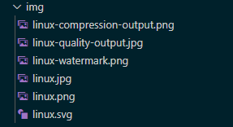
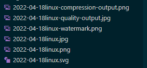

# 任务一：用bash编写一个图片批处理脚本，实现以下功能：

- [x] 支持命令行参数方式使用不同功能

- [x] 支持对指定目录下所有支持格式的图片文件进行批处理

- [x] 支持对jpeg格式图片进行图片质量压缩

- [x] 支持对jpeg/png/svg格式图片在保持原始宽高比的前提下压缩分辨率

- [x] 支持对图片批量添加自定义文本水印

- [x] 支持批量重命名（统一添加文件名前缀或后缀，不影响原始文件扩展名）

- [x] 支持将png/svg图片统一转换为jpg格式图片

  

  ### 部分功能演示：

  | 水印                                       | 分辨率压缩                              | svg to jpg                                      | 质量压缩                                                     |
  | ------------------------------------------ | --------------------------------------- | ----------------------------------------------- | ------------------------------------------------------------ |
  | ./imgprocessing.sh -f path --watermark lsj | ./imgprocessing.sh -f path -c 50        | ./imgprocessing.sh -f path -C                   | ./imgprocessing.sh -f path -p 50                             |
  |     |  |  |  |

  | 批量重命名前                | 批量重命名后               |
  | --------------------------- | -------------------------- |
  |  |  |

  

