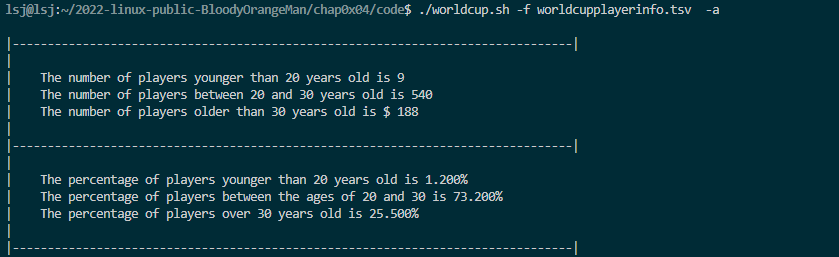
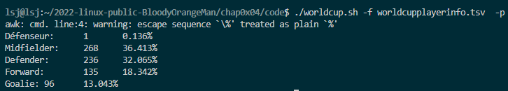
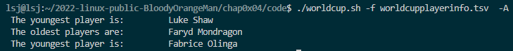
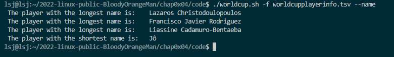
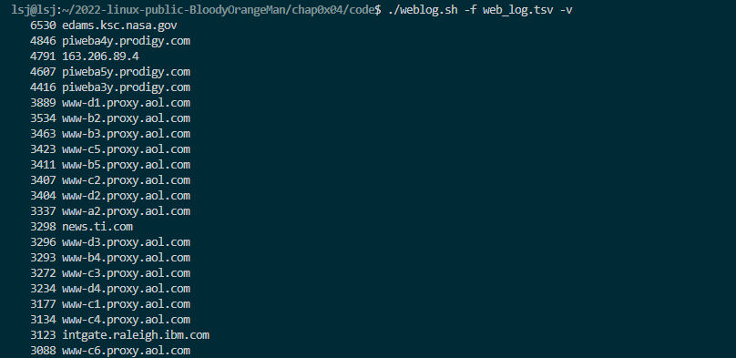
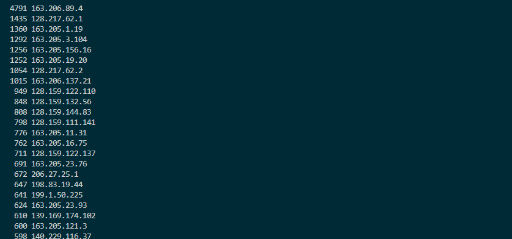
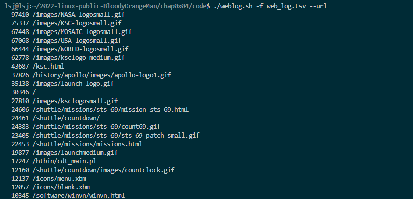
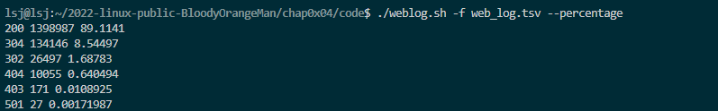
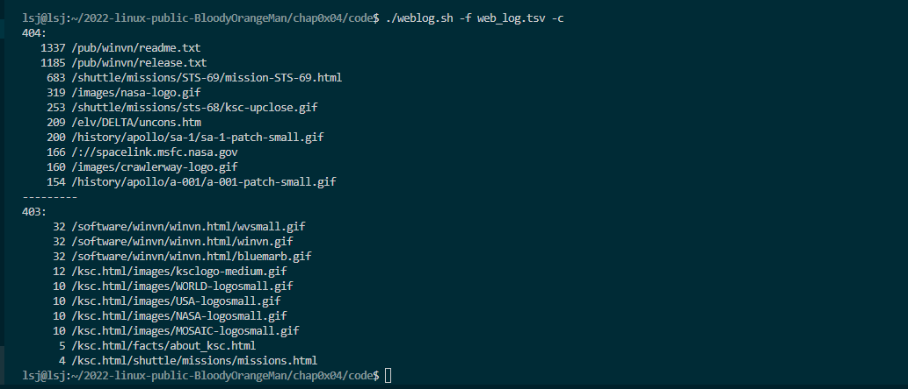
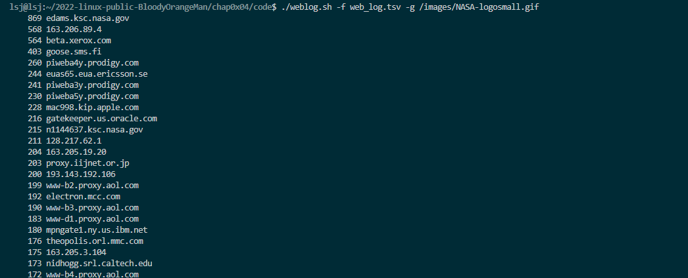

# 1. 实验环境

- **Ubuntu 20.04.4 LTS (Focal Fossa)**
- **VirtualBox 6.1.28**

# 2. 任务一：用bash编写一个图片批处理脚本，实现以下功能：

- [x] 支持命令行参数方式使用不同功能

- [x] 支持对指定目录下所有支持格式的图片文件进行批处理

- [x] 支持对jpeg格式图片进行图片质量压缩

- [x] 支持对jpeg/png/svg格式图片在保持原始宽高比的前提下压缩分辨率

- [x] 支持对图片批量添加自定义文本水印

- [x] 支持批量重命名（统一添加文件名前缀或后缀，不影响原始文件扩展名）

- [x] 支持将png/svg图片统一转换为jpg格式图片

### 	部分功能演示：

| 水印                                       | 分辨率压缩                              | svg to jpg                                      | 质量压缩                                                     |
  | ------------------------------------------ | --------------------------------------- | ----------------------------------------------- | ------------------------------------------------------------ |
  | ./imgprocessing.sh -f path --watermark lsj | ./imgprocessing.sh -f path -c 50        | ./imgprocessing.sh -f path -C                   | ./imgprocessing.sh -f path -p 50                             |
  |     |  |  |  |

  | 批量重命名前                | 批量重命名后               |
  | --------------------------- | -------------------------- |
  |  |  |

# 3. 任务二：用bash编写一个文本批处理脚本，对以下附件分别进行批量处理完成相应的数据统计任务

- [x] 统计不同年龄区间范围（20岁以下、[20-30]、30岁以上）的球员**数量**、**百分比**
- [x] 统计不同场上位置的球员**数量**、**百分比**
- [x] 年龄最大的球员是谁？年龄最小的球员是谁？
- [x] 名字最长的球员是谁？名字最短的球员是谁？

- [x] 统计访问来源主机TOP 100和分别对应出现的总次数
- [x] 统计访问来源主机TOP 100 IP和分别对应出现的总次数
- [x] 统计最频繁被访问的URL TOP 100
- [x] 统计不同响应状态码的出现次数和对应百分比
- [x] 分别统计不同4XX状态码对应的TOP 10 URL和对应出现的总次数
- [x] 给定URL输出TOP 100访问来源主机

### 数据展示：

- 2014世界杯运动员数据

| 结果                         | 问题                                                         |
| ---------------------------- | ------------------------------------------------------------ |
|  | 更多操作统计不同年龄区间范围（20岁以下、[20-30]、30岁以上）的球员**数量**、**百分比** |
|       | 统计不同场上位置的球员**数量**、**百分比**                   |
|        | 年龄最大的球员是谁？年龄最小的球员是谁？                     |
|       | 名字最长的球员是谁？名字最短的球员是谁？                     |

- Web服务器访问日志

| 结果                      | 问题                                                    |
| ------------------------- | ------------------------------------------------------- |
|      | 统计访问来源主机TOP 100和分别对应出现的总次数           |
|          | 统计访问来源主机TOP 100 IP和分别对应出现的总次数        |
|         | 统计最频繁被访问的URL TOP 100                           |
|  | 统计不同响应状态码的出现次数和对应百分比                |
|     | 分别统计不同4XX状态码对应的TOP 10 URL和对应出现的总次数 |
|   | 给定URL输出TOP 100访问来源主机                          |

# 4. 实验问题

- 最初使用getopts处理参数，但在编写代码过程中发现getopts无法处理长参数，因此就改用getopt
- 寻找名字最长球员时忽略了长度相等的可能，随后修改代码
- 并没有做到任意匹配4XX，只是列举了tsv中4XX出现的几种case，代码仍然有改进空间

# 5. 参考资料

- [Getopt - Shell Scripting Tips](https://www.shellscript.sh/tips/getopt/index.html)
- [Linux 命令行与 Shell 脚本教程(WIP) - ShellTutorial - Arch Linux Studio](https://archlinuxstudio.github.io/ShellTutorial/#/?id=linux-命令行与-shell-脚本教程wip-shelltutorial-arch-linux-studio)
- [*How to Add Column with Percentage* - Stack Overflow](https://stackoverflow.com/questions/8303367/how-to-add-column-with-percentage)

