## 1 实验环境

- Windows 11
- VirtualBox6.1.34
- Ubuntu 20.04
- Kali 2021.3
- Nginx/1.18.0 (Ubuntu)
- Openresty v1.15.8.1
- DVWA v1.10 


## 2 安装并配置本次实验环境

#### 2.1 安装并配置VeryNginx

```bash
#安装依赖
apt install libpcre3 libpcre3-dev
apt install libssl-dev
apt install gcc

#安装verynginx
git clone https://github.com/alexazhou/VeryNginx.git
cd VeryNginx
python instal.py install
```

配置文件：

```nginx
events {
    worker_connections  1024;
}

include /opt/verynginx/verynginx/nginx_conf/in_external.conf;

http {
    include       mime.types;
    default_type  application/octet-stream;

    #log_format  main  '$remote_addr - $remote_user [$time_local] "$request" '
    #                  '$status $body_bytes_sent "$http_referer" '
    #                  '"$http_user_agent" "$http_x_forwarded_for"';

    #access_log  logs/access.log  main;
    sendfile        on;
    #tcp_nopush     on;

    #keepalive_timeout  0;
    keepalive_timeout  65;
        client_body_buffer_size 128k;

    #gzip  on;

        #this line shoud be include in every http block
    include /opt/verynginx/verynginx/nginx_conf/in_http_block.conf;

    server {
        listen       80;

        #this line shoud be include in every server block
        include /opt/verynginx/verynginx/nginx_conf/in_server_block.conf;

        location = / {
            root   html;
            index  index.html index.htm;
        }
    }

}
```

确认安装完成：


#### 2.2 安装Nginx与Wordpress

##### 2.2.1 安装依赖

```bash
#安装依赖
apt install mysql-server
apt install php7.4 php7.4-cli php7.4-fpm php7.4-mysql php7.4-json php7.4-opcache php7.4-mbstring php7.4-xml php7.4-gd php7.4-curl

#安装nginx
apt install nginx
```

##### 2.2.2 为Wordpress创建数据库

```mysql
#sudo mysql
CREATE DATABASE wordpress DEFAULT CHARACTER SET utf8 COLLATE utf8_unicode_ci;
CREATE USER 'wordpressuser'@'localhost' IDENTIFIED BY 'password';
GRANT ALL ON wordpress.* TO 'wordpressuser'@'localhost';
EXIT;
```

##### 2.2.3 为Wordpress的配置Nginx文件

```nginx
# mkdir -p /var/www/html/wordpress/public_html
# cd /etc/nginx/sites-available
# cat wordpress.conf
server {
            listen 8080;
            root /var/www/html/wordpress/public_html;
            index index.php index.html;
            server_name wp.sec.cuc.edu.cn;

	    	access_log /var/log/nginx/SUBDOMAIN.access.log;
    	    error_log /var/log/nginx/SUBDOMAIN.error.log;

            location / {
                         try_files $uri $uri/ =404;
            }

            location ~ \.php$ {
                         include snippets/fastcgi-php.conf;
                         fastcgi_pass unix:/run/php/php7.4-fpm.sock;
            }
            
            location ~ /\.ht {
                         deny all;
            }

            location = /favicon.ico {
                         log_not_found off;
                         access_log off;
            }

            location = /robots.txt {
                         allow all;
                         log_not_found off;
                         access_log off;
           }
       
            location ~* \.(js|css|png|jpg|jpeg|gif|ico)$ {
                         expires max;
                         log_not_found off;
           }
}
# 确认配置文件无误
# nginx -t
nginx: the configuration file /etc/nginx/nginx.conf syntax is ok
nginx: configuration file /etc/nginx/nginx.conf test is successful

# 为配置文件建立软链接
# cd /etc/nginx/sites-enabled
# ln -s ../sites-available/wordpress.conf .

```

##### 2.2.4 下载并配置WordPress

```bash
cd /var/www/html/wordpress/public_html
#实验要求版本为WordPress 4.7
wget https://github.com/WordPress/WordPress/archive/4.7.zip
unzip 4.7.zip
mv wordpress/* .
rm -rf wordpress

#给nginx管理权限
chown -R www-data:www-data *
chmod -R 755 *

#配置WordPress

# cd /var/www/html/wordpress/public_html
# mv wp-config-sample.php wp-config.php
# vi wp-config.php
# 配置同创建数据库时一致 
 ...
 ...
 define('DB_NAME', 'wordpress');
 define('DB_USER', 'wordpressuser');
 define('DB_PASSWORD', 'password');
 ...
 ...
```

##### 2.2.5 访问网页端安装WordPress

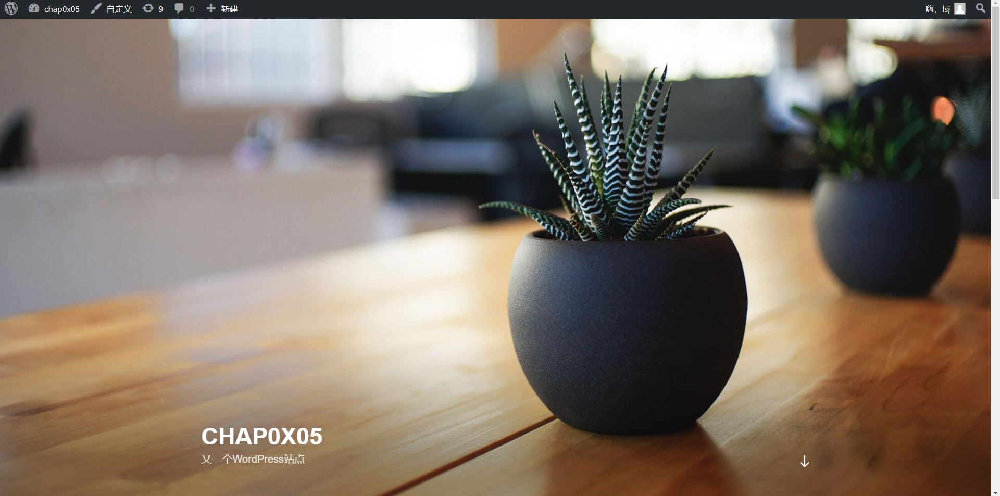


#### 2.3 安装DVWA

安装过程与WordPress类似，这里展示配置文件

##### 2.3.1 DVWA的Nginx配置文件

```nginx
server {
    listen 81 default_server;

    root /var/www/html/dvwa;
    index index.php index.html index.htm index.nginx-debian.html;
    server_name dvwa.sec.cuc.edu.cn;

    location / {
        #try_files $uri $uri/ =404;
        try_files $uri $uri/ /index.php$is_args$args;
    }

    location ~ \.php$ {
        include snippets/fastcgi-php.conf;
        fastcgi_pass unix:/var/run/php/php7.4-fpm.sock;
    }

    location ~ /\.ht {
        deny all;
    }
}
```

##### 2.3.2 DVWA的Nginx配置文件

```php
<?php

# If you are having problems connecting to the MySQL database and all of the variables below are correct
# try changing the 'db_server' variable from localhost to 127.0.0.1. Fixes a problem due to sockets.
#   Thanks to @digininja for the fix.

# Database management system to use
$DBMS = 'MySQL';
#$DBMS = 'PGSQL'; // Currently disabled

# Database variables
#   WARNING: The database specified under db_database WILL BE ENTIRELY DELETED during setup.
#   Please use a database dedicated to DVWA.
#
# If you are using MariaDB then you cannot use root, you must use create a dedicated DVWA user.
#   See README.md for more information on this.
$_DVWA = array();
$_DVWA[ 'db_server' ]   = '127.0.0.1';
$_DVWA[ 'db_database' ] = 'dvwa';
$_DVWA[ 'db_user' ]     = 'dvwa';
$_DVWA[ 'db_password' ] = 'p@ssw0rd';
$_DVWA[ 'db_port'] = '3306';

# ReCAPTCHA settings
#   Used for the 'Insecure CAPTCHA' module
#   You'll need to generate your own keys at: https://www.google.com/recaptcha/admin
$_DVWA[ 'recaptcha_public_key' ]  = '';
$_DVWA[ 'recaptcha_private_key' ] = '';

# Default security level
#   Default value for the security level with each session.
#   The default is 'impossible'. You may wish to set this to either 'low', 'medium', 'high' or impossible'.
$_DVWA[ 'default_security_level' ] = 'impossible';

# Default PHPIDS status
#   PHPIDS status with each session.
#   The default is 'disabled'. You can set this to be either 'enabled' or 'disabled'.
$_DVWA[ 'default_phpids_level' ] = 'disabled';

# Verbose PHPIDS messages
#   Enabling this will show why the WAF blocked the request on the blocked request.
#   The default is 'disabled'. You can set this to be either 'true' or 'false'.
$_DVWA[ 'default_phpids_verbose' ] = 'false';

# Default locale
#   Default locale for the help page shown with each session.
#   The default is 'en'. You may wish to set this to either 'en' or 'zh'.
$_DVWA[ 'default_locale' ] = 'en';
define ("MYSQL", "mysql");
define ("SQLITE", "sqlite");
$_DVWA[ 'recaptcha_public_key' ] = '6LfYNewfAAAAAFakMVL_GZaXKK-wuky1gHRaFWkS';
$_DVWA[ 'recaptcha_private_key' ] = '6LfYNewfAAAAAEyprSHF3FGYuytI5daV_eCUXhZR';
# SQLi DB Backend
#   Use this to switch the backend database used in the SQLi and Blind SQLi labs.
#   This does not affect the backend for any other services, just these two labs.
#   If you do not understand what this means, do not change it.
$_DVWA["SQLI_DB"] = MYSQL;
#$_DVWA["SQLI_DB"] = SQLITE;
#$_DVWA["SQLITE_DB"] = "sqli.db";

?>
```

##### 2.3.3 检查DVWA安装

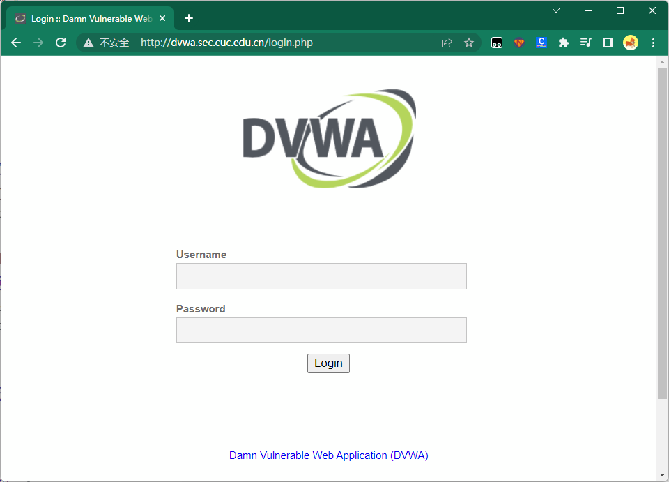

#### 2.4 在VeryNginx中配置反向代理

配置如图：

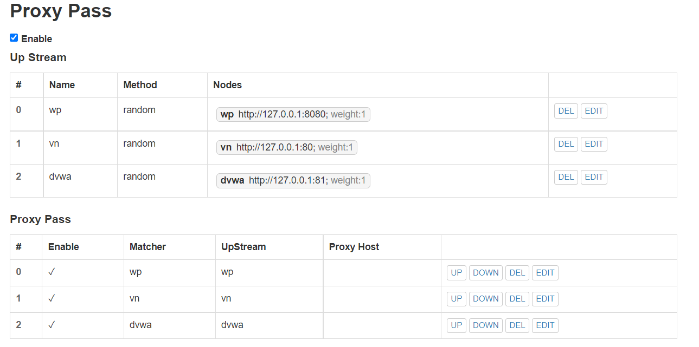

#### 2.5 网络拓扑图

至此，本次实验网络拓扑图为：

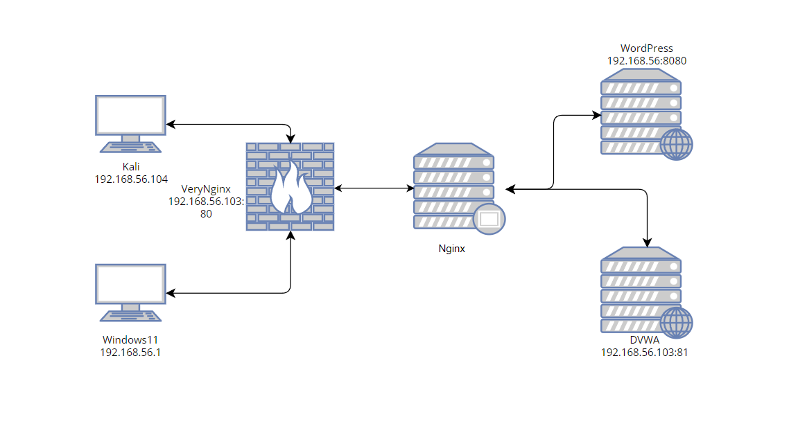

## 3 安全加固要求

#### 3.1 使用IP地址方式均无法访问上述任意站点，并向访客展示自定义的友好错误提示信息页面-1

| 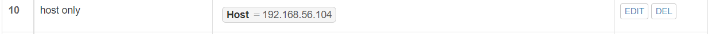 | 添加匹配规则           |
| -------------------------------- | ---------------------- |
| 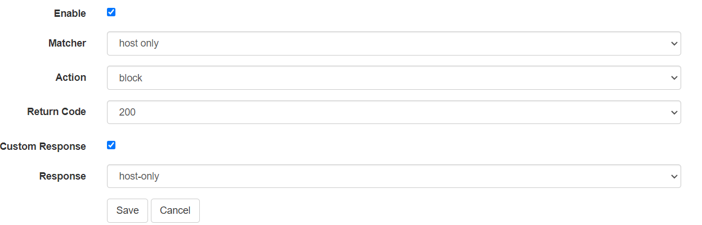   | 添加过滤器             |
| 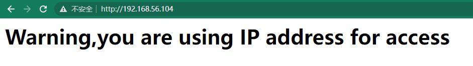 | 友好错误提示信息页面-1 |

#### 3.2 Damn Vulnerable Web Application (DVWA)只允许白名单上的访客来源IP，其他来源的IP访问均向访客展示自定义的**友好错误提示信息页面-2**

配置类似上面过程，展示配置结果

| Kali(192.168.56.104)                | Windows(192.168.56.1)      |
| ----------------------------------- | -------------------------- |
| 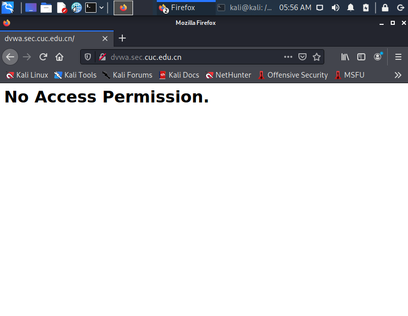 |  |

#### 3.3 在不升级WordPress版本的情况下，通过定制VeryNginx的访问控制策略规则，**热**修复WordPress < 4.7.1 - Username Enumeration

在Kali中运行脚本得到如下json串：

```json
[{"id":1,"name":"lsj","url":"","description":"","link":"http:\/\/192.168.56.104:8080\/author\/lsg\/","slug":"lsj","avatar_urls":{"24":"http:\/\/1.gravatar.com\/avatar\/d05c9acf0c799bfd826160e21d02584b?s=24&d=mm&r=g","48":"http:\/\/1.gravatar.com\/avatar\/d05c9acf0c799bfd826160e21d02584b?s=48&d=mm&r=g","96":"http:\/\/1.gravatar.com\/avatar\/d05c9acf0c799bfd826160e21d02584b?s=96&d=mm&r=g"},"meta":[],"_links":{"self":[{"href":"http:\/\/192.168.56.104:8080\/wp-json\/wp\/v2\/users\/1"}],"collection":[{"href":"http:\/\/192.168.56.104:8080\/wp-json\/wp\/v2\
```

| 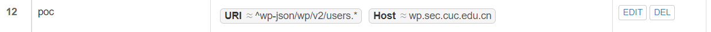 | 添加匹配规则   |
| -------------------------- | -------------- |
| 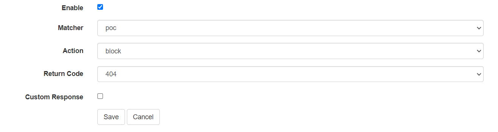  | 添加过滤器     |
| 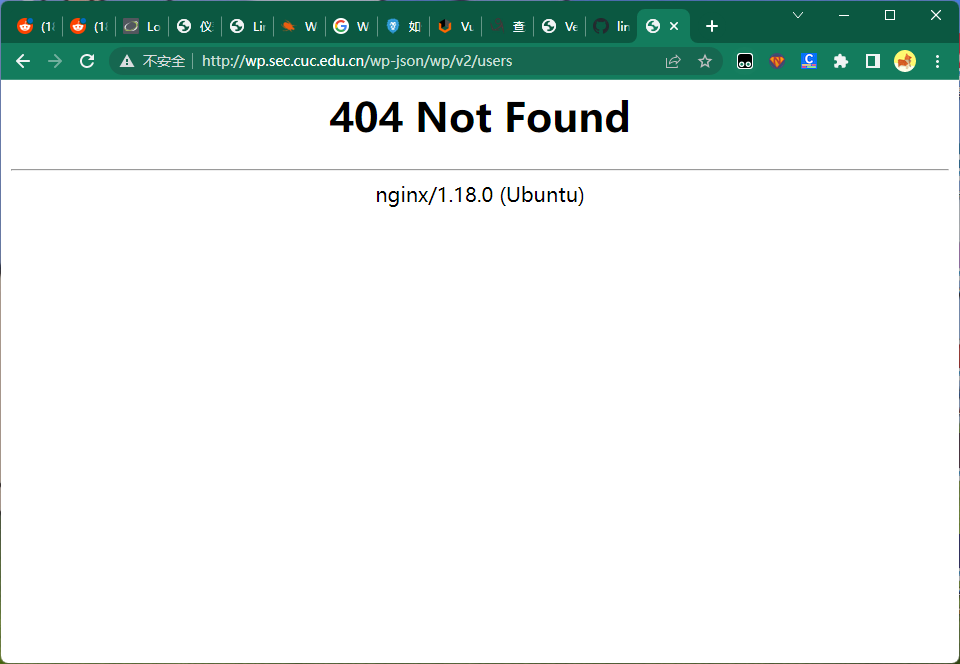     | 不再得到json串 |

#### 3.4 通过配置VeryNginx的Filter规则实现对Damn Vulnerable Web Application (DVWA)的SQL注入实验在低安全等级条件下进行防护

| 添加匹配规则与过滤器： | 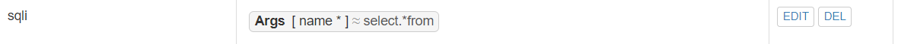 | 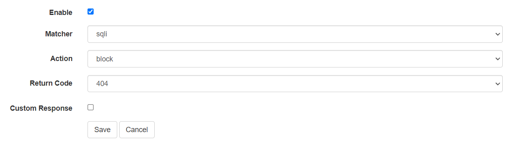 |
| ---------------------- | --------------------------- | -------------------------- |
| 添加前后               | 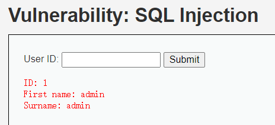         | 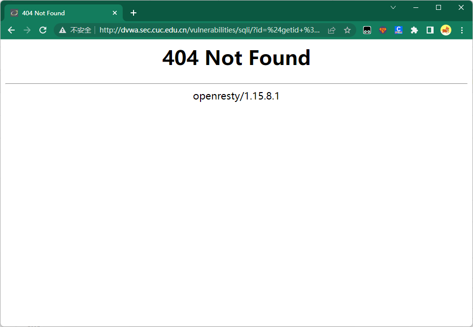    |


## 4 VeryNginx配置要求

####  4.1 VeryNginx的Web管理页面仅允许白名单上的访客来源IP，其他来源的IP访问均向访客展示自定义的**友好错误提示信息页面-3**

与上面DVWA白名单类似，展示结果：

| Kali(192.168.56.104)           | Windows(192.168.56.1)                                   |
| ------------------------------ | ------------------------------------------------------- |
| 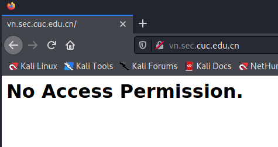 | 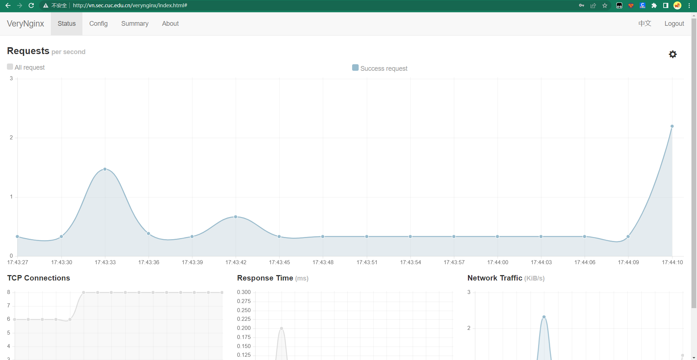 |

#### 4.2 通过定制VeryNginx的访问控制策略规则实现

- 限制DVWA站点的单IP访问速率为每秒请求数 < 50
- 限制Wordpress站点的单IP访问速率为每秒请求数 < 20
- 超过访问频率限制的请求直接返回自定义**错误提示信息页面-4**

在VeryNginx的Frequency Limit中设置：

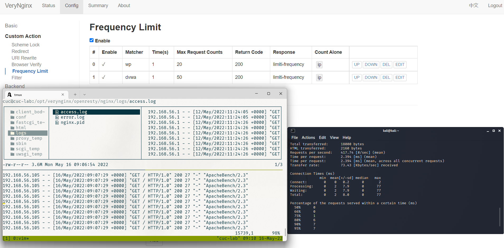

在Kali中执行ab压测工具：

```
                                                                                                  
┌──(kali㉿kali)-[~]
└─$ ab -n 100 http://wp.sec.cuc.edu.cn/
This is ApacheBench, Version 2.3 <$Revision: 1879490 $>
Copyright 1996 Adam Twiss, Zeus Technology Ltd, http://www.zeustech.net/
Licensed to The Apache Software Foundation, http://www.apache.org/

Benchmarking wp.sec.cuc.edu.cn (be patient).....done


Server Software:        openresty/1.15.8.1
Server Hostname:        wp.sec.cuc.edu.cn
Server Port:            80

Document Path:          /
Document Length:        0 bytes

Concurrency Level:      1
Time taken for tests:   0.261 seconds
Complete requests:      100
Failed requests:        80
   (Connect: 0, Receive: 0, Length: 80, Exceptions: 0)
Non-2xx responses:      100
Total transferred:      29200 bytes
HTML transferred:       12720 bytes
Requests per second:    383.40 [#/sec] (mean)
Time per request:       2.608 [ms] (mean)
Time per request:       2.608 [ms] (mean, across all concurrent requests)
Transfer rate:          109.33 [Kbytes/sec] received

Connection Times (ms)
              min  mean[+/-sd] median   max
Connect:        0    0   2.0      0      19
Processing:     0    2   7.6      0      73
Waiting:        0    2   7.6      0      73
Total:          0    3   8.0      0      73

Percentage of the requests served within a certain time (ms)
  50%      0
  66%      0
  75%      1
  80%      6
  90%      7
  95%      8
  98%     26
  99%     73
 100%     73 (longest request)
```

可以看到**Failed requests**一项为80，说明访问速率限制起效

#### 4.3 禁止curl访问

在日志中查询到curl访问的User Agent为：


添加curl匹配规则：

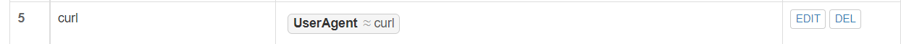

再添加过滤器后实现效果：

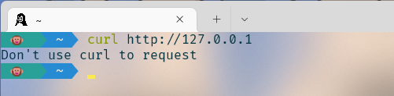

## 5 实验问题

一开始我使用VeryNginx仓库中的Release包进行编译安装，出现如下报错：

```c
cc -c -pipe  -O -W -Wall -Wpointer-arith -Wno-unused -Werror -g -Wno-error -I src/core -I src/event -I src/event/modules -I src/os/unix -I objs \
    -o objs/src/os/unix/ngx_posix_init.o \
    src/os/unix/ngx_posix_init.c
cc -c -pipe  -O -W -Wall -Wpointer-arith -Wno-unused -Werror -g -Wno-error -I src/core -I src/event -I src/event/modules -I src/os/unix -I objs \
    -o objs/src/os/unix/ngx_user.o \
    src/os/unix/ngx_user.c
src/os/unix/ngx_user.c: In function ‘ngx_libc_crypt’:
src/os/unix/ngx_user.c:36:7: error: ‘struct crypt_data’ has no member named ‘current_salt’
   36 |     cd.current_salt[0] = ~salt[0];
      |       ^
make[1]: *** [objs/Makefile:749: objs/src/os/unix/ngx_user.o] Error 1
```

查询后得知，这是一个出现在较老版本的Nginx上游问题，想解决得修改文件手动编译

后来发现VeryNginx仓库源码比Release新，直接git clone仓库源码即可

随后检查出错源文件：

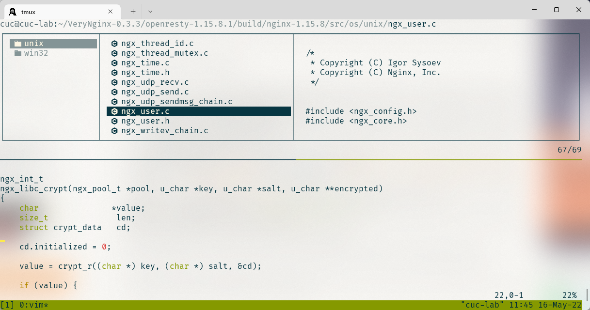

发现新版本的Openresty(以及Nginx)已经将那行错误代码删掉，并且也编译正确。

- 参考：[nginx won't build under libxcrypt due to missing 'current_salt' in 'crypt_data' struct](https://trac.nginx.org/nginx/ticket/1469)


## 6 参考资料

- [How to Install WordPress with LEMP on Ubuntu 20.04](https://www.digitalocean.com/community/tutorials/how-to-install-wordpress-with-lemp-on-ubuntu-20-04)
- [Install WordPress with Nginx on Ubuntu 18.04](https://www.journaldev.com/25670/install-wordpress-nginx-ubuntu)
- [ DVWA](https://github.com/digininja/DVWA)
- [VeryNginx](https://github.com/alexazhou/VeryNginx)
- [WordPress < 4.7.1 - Username Enumeration](https://www.exploit-db.com/exploits/41497/)

